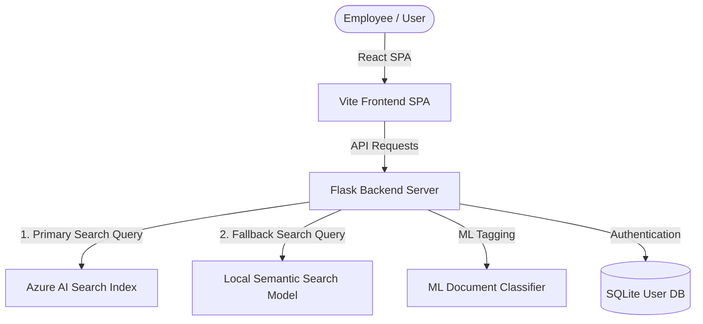

# System Design and Architecture Guide

## Overview

The Nexus Solutions Intelligent Search Application is a high-performance employee self-service portal designed to allow natural language search across structured and unstructured policy documents (HR, IT, Finance). The system utilizes Azure AI Search as its primary search service, with a robust local semantic Sentence-Transformers fallback search layer.

## Component Architecture



## Folder Structure

```text
├── docs/                      # Architectural & design documentation
│   ├── architecture.md
│   ├── api_documentation.md
│   ├── deployment_guide.md
│   └── user_manual.md
├── src/                       # React / Vite SPA frontend
│   ├── app/
│   │   ├── App.tsx            # Main application UI & state
│   │   ├── AuthPage.tsx       # Sign In & Registration portal
│   │   ├── AdminPanel.tsx     # Admin dashboard
│   │   └── components/
│   └── styles/
│       └── index.css          # Styling & Tailwind definitions
├── server.py                  # Flask REST API backend server
├── build_local_index.py       # Local semantic index builder
├── evaluate_model.py          # ML performance evaluation script
├── data_preprocessing.py      # Clean dataset & standardize columns
├── generate_sample_data.py    # Populate mockup employee files
├── users.db                   # Local user authentication DB
├── .env                       # Environment variables config
└── requirements.txt           # Python application dependencies
```
