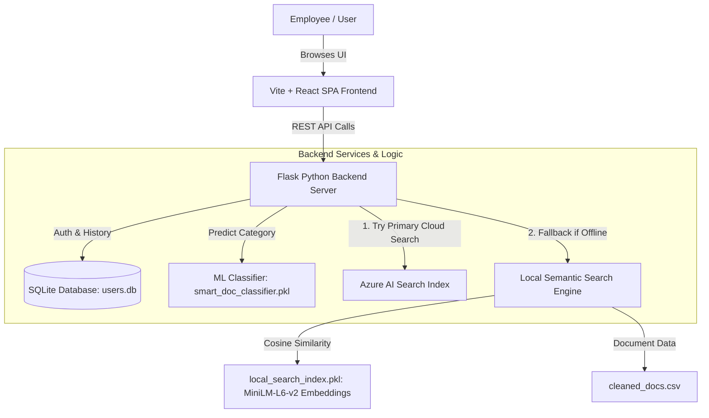

# SmartDoc Search — Comprehensive Project Guidebook

Welcome to the **SmartDoc Search System Guidebook**. This document serves as the master reference manual for team members, developers, and stakeholders. It details the complete technology stack, system architecture, database structure, AI/ML models, server infrastructure, and step-by-step workflow of how the project was built.

---

## 1. Executive Summary

**SmartDoc Search** (Nexus Solutions Intelligent Search) is an AI-powered enterprise document discovery and classification platform. It enables employees to search policy documents (HR, IT, Finance, Legal, Operations) using natural language, receive instant semantic search results with relevance scoring, and leverage machine learning for document categorization.

### Key Highlights
- **Dual-Engine Search Architecture**: Uses **Azure AI Search** as the primary enterprise cloud engine, with an automatic fallback to a **Local Sentence-Transformers Semantic Engine** if cloud connectivity is unavailable.
- **Smart ML Document Classifier**: Predicts document category tags using a trained Scikit-learn TF-IDF model.
- **User Portal & Admin Analytics**: Offers full user authentication, search history logging, document CRUD, and interactive analytics dashboard.

---

## 2. Complete Technology Stack & Tooling Inventory

| Component Category | Technology / Tool | Version / Library | Purpose & Role |
| :--- | :--- | :--- | :--- |
| **Frontend Framework** | React + TypeScript | React 18.3 | User Interface rendering, component state management, type safety |
| **Build & Dev Tool** | Vite | 6.3.5 | Ultra-fast HMR local server, JSX/TSX bundling, and production build compiler |
| **Styling & UI Utility** | Tailwind CSS | 4.1.12 | Utility-first CSS framework for modern design and layout styling |
| **UI Components** | Radix UI | Latest Primitives | Accessible headless UI primitives (Dialogs, Tabs, Tooltips, Accordions) |
| **Icons & Micro-UI** | Lucide React / MUI Icons | 0.487 / 7.3 | High-quality scalable vector icons |
| **Animations** | Motion (Framer Motion) | 12.23 | Smooth page transitions and interactive micro-animations |
| **Data Visualization** | Recharts | 2.15.2 | Analytics charts for admin dashboard (query trends, categories) |
| **Toast Notifications** | Sonner | 2.0.3 | Interactive toast messages for feedback |
| **Backend Framework** | Flask (Python) | 3.0.0 | Lightweight RESTful Web API backend server |
| **Cross-Origin Access** | Flask-CORS | 4.0.0 | Enables secure communication between Vite (`:5173`) and Flask (`:5000`) |
| **Environment Mgmt** | python-dotenv | 1.0.0 | Secure loading of environment variables from `.env` |
| **Relational Database** | SQLite 3 | Embedded | Local database storing user credentials and search history logs |
| **Primary Cloud Search** | Azure AI Search SDK | `azure-search-documents` 11.4 | Cloud vector index, full-text search, and semantic ranking |
| **Local AI Embeddings** | Sentence-Transformers | 2.6.0 (`all-MiniLM-L6-v2`) | Local 384d dense vector embeddings generation for semantic search |
| **ML Classification** | Scikit-Learn | 1.3.0 | TF-IDF Vectorizer + Supervised ML model (`smart_doc_classifier.pkl`) |
| **Math & Data Ops** | NumPy & Pandas | 1.24+ / 2.0+ | Vector math, matrix operations, and CSV dataset manipulation |
| **Data Visualization** | Matplotlib / Seaborn | 3.7+ / 0.12+ | Model performance evaluation charts (Confusion Matrix, ROC Curve) |

---

## 3. System Architecture & Dual-Engine Search Strategy

The platform is designed around high availability, ensuring uninterrupted search capabilities even if cloud services are disconnected or unconfigured.



### Search Execution Strategy:
1. **Azure AI Search (Primary)**: When `AZURE_SEARCH_ENDPOINT` and `AZURE_SEARCH_API_KEY` are provided in `.env`, the system queries the Azure Search cloud index using full-text and semantic ranking.
2. **Sentence-Transformers (Local Fallback)**: If Azure Search is inactive or fails, the backend calculates real-time **Cosine Similarity** between the user query's embedding vector (`all-MiniLM-L6-v2`) and pre-calculated document vectors stored in `local_search_index.pkl`.

---

## 4. How It Was Built ("How Made It Done")

The system was developed following a modular, 5-phase engineering process:

```
[Phase 1: Data Pipeline] ➔ [Phase 2: ML & AI Index] ➔ [Phase 3: Flask Backend] ➔ [Phase 4: React UI] ➔ [Phase 5: Testing & QA]
```

### Phase 1: Data Generation & Preprocessing
1. **Data Generation** (`generate_sample_data.py`): Programmatically generated realistic employee policy documents covering IT security, HR benefits, remote work, finance reimbursement, and compliance.
2. **Preprocessing Pipeline** (`data_preprocessing.py`): Cleaned raw text, normalized field names (`id`, `title`, `text`, `category`), stripped invalid characters, generated snippets, and exported standard `cleaned_docs.csv`.

### Phase 2: AI Embeddings & ML Model Training
1. **Local Semantic Indexing** (`build_local_index.py`):
   - Loaded document text from `cleaned_docs.csv`.
   - Utilized HuggingFace `SentenceTransformer('all-MiniLM-L6-v2')` to map each document into a 384-dimensional vector space.
   - Saved document objects and embedding matrices into `local_search_index.pkl`.
2. **ML Document Classifier Training & Evaluation** (`evaluate_model.py`):
   - Trained a TF-IDF classifier on document texts to automatically predict categories (`HR`, `IT`, `Finance`, `Security`).
   - Evaluated accuracy, precision, cross-validation scores, and rendered visual charts (`confusion_matrix.png`, `cv_scores.png`, `roc_curve.png`).
   - Serialized trained classifier model to `src/smart_doc_classifier.pkl`.

### Phase 3: Flask REST API & SQLite Database
1. **Database Schema Setup**: Created `users.db` SQLite database with `users` (registration/auth) and `search_history` tables.
2. **REST API Endpoints**:
   - `POST /api/register` & `POST /api/login`: Secure password hashing using SHA-256 and user session responses.
   - `GET /api/search?q=...`: Intelligent search logic executing Azure AI Search or fallback local vector cosine similarity.
   - `POST /api/classify`: Real-time category prediction using the pickle ML classifier model.
   - `GET /api/analytics`: Aggregates search history, query counts, and category statistics.
   - `POST /api/azure/bulk-import`: Admin utility to push preprocessed documents directly into Azure AI Search index.

### Phase 4: Modern React + Vite Frontend
1. **Design System & Components**: Built responsive component tree with React, TypeScript, Tailwind CSS, and Radix UI.
2. **State & Routing**: Integrated login portal state, category filtering, search input debouncing, real-time result cards, and modal previews.
3. **Admin Dashboard**: Created interactive metrics panel with Recharts visualization for system query analytics.

### Phase 5: Verification & Quality Assurance
1. **Automated Verification Script** (`verify_requirements.py`): Validated python package installations, database file integrity, model loading, and API endpoint readiness.
2. **Documentation & Test Suite**: Formatted complete test cases (`docs/test_cases.md`), test designs (`docs/test_design.md`), and API documentation (`docs/api_documentation.md`).

---

## 5. Database Schema & Data Models

### 1. SQLite User Database (`users.db`)

#### Table: `users`
| Field | Type | Modifiers | Description |
| :--- | :--- | :--- | :--- |
| `id` | INTEGER | PRIMARY KEY AUTOINCREMENT | Unique user ID |
| `name` | TEXT | NOT NULL | User's full name |
| `email` | TEXT | UNIQUE NOT NULL | Account email address |
| `password_hash` | TEXT | NOT NULL | SHA-256 hashed password |
| `created_at` | TIMESTAMP | DEFAULT CURRENT_TIMESTAMP | Account creation date |

#### Table: `search_history`
| Field | Type | Modifiers | Description |
| :--- | :--- | :--- | :--- |
| `id` | INTEGER | PRIMARY KEY AUTOINCREMENT | Search record ID |
| `user_id` | INTEGER | FOREIGN KEY (`users.id`) | ID of user who searched |
| `query` | TEXT | NOT NULL | Search text entered |
| `searched_at` | TIMESTAMP | DEFAULT CURRENT_TIMESTAMP | Timestamp of query |

---

## 6. How to Run the Project Locally

### Step 1: Install Dependencies
- **Python Dependencies**:
  ```bash
  pip install -r requirements.txt
  ```
- **Node.js Frontend Dependencies**:
  ```bash
  npm install
  ```

### Step 2: Build Local Search Index (First Time Setup)
```bash
python data_preprocessing.py
python build_local_index.py
```

### Step 3: Launch Application
- **Option A (Automated Batch File)**:
  Run [start_server.bat](file:///c:/Users/moham/Downloads/Smart%20Doc%20Search%20App%20Design/start_server.bat) to launch both Flask backend (`:5000`) and Vite frontend (`:5173`).

- **Option B (Manual Command Line)**:
  - Terminal 1 (Backend): `python server.py`
  - Terminal 2 (Frontend): `npm run dev`

Open browser at: **`http://localhost:5173`**

---

## 7. Project File & Folder Map

```text
Smart Doc Search App Design/
├── docs/                             # Full Documentation Suite
│   ├── project_guidebook.md          # Master Project & Team Guidebook (This file)
│   ├── architecture.md               # System Architecture Diagrams & Specs
│   ├── api_documentation.md          # REST API Specification & Payload Formats
│   ├── deployment_guide.md           # Azure AI Search & SWA Deployment Guide
│   ├── evaluation_report.md          # ML Model Precision/Recall/F1 Performance
│   └── user_manual.md                # End-User UI Navigation Guide
├── src/                              # Frontend React Application Source
│   ├── app/
│   │   ├── App.tsx                   # Main Application Shell & UI State
│   │   ├── AuthPage.tsx              # Sign-In / Registration UI Component
│   │   └── AdminPanel.tsx            # Admin Dashboard & Analytics UI
│   ├── smart_doc_classifier.pkl      # Trained ML Document Classifier Model
│   └── styles/index.css              # Styling Tokens & Tailwind Configuration
├── server.py                         # Flask REST API Backend & Azure/Local Search Router
├── build_local_index.py              # Sentence-Transformers Embedding Generator
├── data_preprocessing.py             # Raw Document Cleansing & Standardizer
├── evaluate_model.py                 # ML Model Evaluation & Chart Generator
├── generate_sample_data.py           # Employee Policy Sample Data Generator
├── verify_requirements.py            # Environment & Dependency Verifier Script
├── local_search_index.pkl            # Serialized Vector Index & Document Embeddings
├── users.db                          # SQLite Database for User Auth & Search History
├── cleaned_docs.csv                  # Processed Policy Documents Dataset
├── .env                              # Environment Variables & Azure Configuration
├── package.json                      # Frontend Node Dependencies & Scripts
├── requirements.txt                  # Backend Python Dependencies
├── start_server.bat                  # One-Click Launch Script (Flask + Vite)
└── vite.config.ts                    # Vite Build Configuration & HMR Settings
```

---

## 8. Team Onboarding Quick Reference

- **Frontend Developers**: Work inside [src/app](file:///c:/Users/moham/Downloads/Smart%20Doc%20Search%20App%20Design/src/app). Tech stack is React 18, TypeScript, Tailwind CSS v4, and Radix UI.
- **Backend & ML Engineers**: Work inside [server.py](file:///c:/Users/moham/Downloads/Smart%20Doc%20Search%20App%20Design/server.py), [build_local_index.py](file:///c:/Users/moham/Downloads/Smart%20Doc%20Search%20App%20Design/build_local_index.py), and [evaluate_model.py](file:///c:/Users/moham/Downloads/Smart%20Doc%20Search%20App%20Design/evaluate_model.py).
- **DevOps & Cloud Engineers**: Refer to [deployment_guide.md](file:///c:/Users/moham/Downloads/Smart%20Doc%20Search%20App%20Design/docs/deployment_guide.md) to set up Azure AI Search indices and Azure Static Web Apps.
